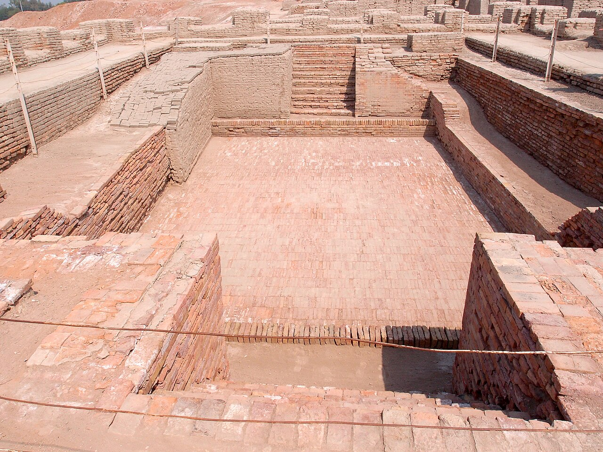
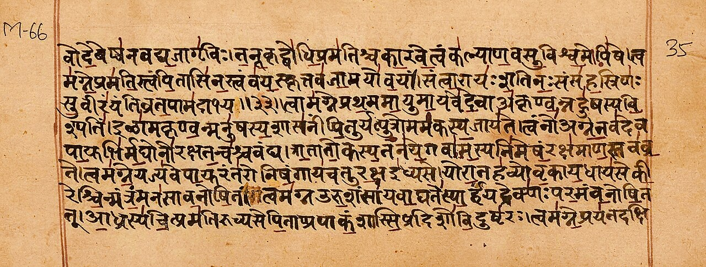

For nearly 150 years, Indian schoolchildren were taught a story: around 1500 BCE, fair-skinned Aryan invaders rode into India, destroyed the Harappan civilization, and imposed their language and the Vedas on the dark-skinned natives.

It is one of the most consequential claims in Indian history. It divided North from South, Aryan from Dravidian, and gave every divisive politics its favorite vocabulary.

There is only one problem with it. The evidence never showed up.

Let us go through the evidence, piece by piece.

## 1. The invasion that never happened

The original "proof" of the invasion came from Sir Mortimer Wheeler, who excavated Harappa in the 1940s. He found some scattered skeletons at Mohenjo-daro and, reading the Rig Veda's description of Indra as "destroyer of forts," declared: "On circumstantial evidence, Indra stands accused." A massacre by Aryan invaders, he said, finished the Harappan civilization.

That claim has been demolished by archaeology itself:

- Out of a city of more than 40,000 people, only about 40 skeletons were found in these contexts. That is not a city-wide slaughter.
- Forensic study found no weapon trauma on the bones. No sword cuts, no arrow wounds. In the 1980s, biological anthropologist K.A.R. Kennedy and colleagues confirmed there was no skeletal evidence of violent death.
- The skeletons were not from the same period. They came from different layers, some separated by centuries, some from deposits laid down after the site was abandoned. There was no single event.
- As archaeologist George Dales asked in his famous 1964 paper "The Mythical Massacre at Mohenjo-daro": where are the burned fortresses, the arrowheads, the weapons, the smashed chariots, the bodies of the invaders? Despite extensive excavation, none were ever found. No destruction layer covers the latest period of the city.

Dales called it exactly what it was: a mythical massacre. The invasion's founding evidence does not exist.

## 2. The DNA evidence

In September 2019, the journal Cell published the first ancient Harappan genome, sequenced from a woman buried at Rakhigarhi in Haryana, the largest Harappan site. The team included Vasant Shinde, Niraj Rai, and Harvard geneticist David Reich. The paper's title says it all: "An Ancient Harappan Genome Lacks Ancestry from Steppe Pastoralists or Iranian Farmers."

The findings:

- The Harappan individual had no detectable Steppe pastoralist ancestry, the genetic signature associated with the supposed Aryan migrants.
- The Harappans were an indigenous South Asian population with continuity going back before 7000 BCE.
- Farming in South Asia was not brought by migrants from the west; it developed locally.
- The study states that the Harappan population is the largest source of ancestry for present-day South Asians. That is continuity, not replacement.

Lead author Vasant Shinde stated plainly: there was no Aryan invasion and no Aryan migration; everything from the hunting-gathering stage to modern times in South Asia was done by indigenous people.

Note what the defenders did next: they quietly changed the word. "Invasion" became "migration." When the massacre evidence collapsed, the theory moved the goalposts. But even the migration version keeps shrinking: the genetic signal it points to appears late, in small amounts, in limited regions, long after the Harappan peak, and it never replaced anyone.

## 3. The river that dates the Veda

The Rig Veda mentions the river Sarasvati about 50 times, describing it as a mighty, snow-fed river, greater than the Indus. Geological and satellite studies have identified it with the Ghaggar-Hakra system, whose wide paleochannels, 8 to 12 kilometers across in places, show it was once a great river.

And here is the problem for the invasion timeline: the river dried up. OSL dating, sediment analysis, and B.B. Lal's excavations at Kalibangan on the Sarasvati's bank show the river was in decline by around 2000 BCE and had essentially dried up by about 1800 BCE.

The Rig Veda describes the Sarasvati in full flow. It cannot have been composed after the river died. That pushes the Rig Veda earlier than 2000 BCE, centuries before the supposed Aryan arrival of 1500 BCE.

The conventional 1200 BCE date for the Rig Veda was Max Muller's conjecture, and even his contemporaries knew it was guesswork. The river does not lie: the Veda is older than the invasion that supposedly brought it.

## 4. "Arya" was never a race

The entire theory rests on a word. "Arya" in Sanskrit means noble, honorable, or excellent. It is a cultural and ethical term, not a racial one.

Even Max Muller, the man whose dating created the whole framework, admitted it late in life: "Aryan, in scientific language, is utterly inapplicable to race. It means language and nothing but language."

Read that again. The architect of the theory conceded that "Aryan" was never a people. Yet generations were taught about an Aryan race invading India. A linguistic label was turned into a racial invasion by people with an empire to justify.

## 5. The Middle East worshipped Vedic gods 3,400 years ago

Here is the evidence the textbooks skip. Around 1380 BCE, in what is now Syria, the Mitanni kingdom signed a treaty with the Hittites. The treaty invokes four gods as witnesses: Mitra, Varuna, Indra, and Nasatya, the Ashvins. These are Rigvedic deities, in Rigvedic order.

A Mitanni horse-training manual from around 1400 BCE uses Sanskrit numerals: aika (eka, one), tera (tri, three), panza (pancha, five), satta (sapta, seven). The Mitanni warrior aristocracy called themselves marya, the Sanskrit word for young warrior. The Kassites who ruled Mesopotamia carried the same Indic element.

So 3,400 years ago, the ruling elite of the ancient Middle East swore by Vedic gods and counted in Sanskrit. The mainstream explanation is that Indo-Aryan speakers migrated west from Central Asia. But notice what this proves regardless of direction: the Vedic cultural world was already fully formed and prestigious enough to be invoked by kings in Syria centuries before the supposed Aryans even reached India.

Ask the obvious question: if the Aryans only arrived in India around 1500 BCE and composed the Vedas afterward, how were Syrian kings swearing by Indra and Varuna in 1380 BCE?

## 6. Who copied whom?

In 1786, William Jones noticed Sanskrit's systematic affinity with Greek and Latin. The mainstream conclusion: all three descend from a common ancestor, Proto-Indo-European.

But here is what is rarely said clearly: Proto-Indo-European has never been found. No text, no inscription, no speaker. It is a reconstructed language, built backwards from its supposed daughters. The entire family tree rests on an ancestor nobody has ever seen.

Now consider the alternative the evidence allows. Sanskrit is the oldest attested member of the family with a complete, scientific grammar, Panini's Ashtadhyayi, composed over two thousand years ago, so precise that modern computer scientists study it. Vedic deities were worshipped in the Middle East in 1380 BCE. The similarities Jones found are real. The direction of the relationship, mother or sister, is assumed, not proven.

The claim deserves to be stated plainly: the ancient languages of Europe and the Middle East show the deep imprint of the Sanskrit tradition, and the burden of proof is on those who insist the flow went the other way around an invisible ancestor.

## Why the theory survived

If the evidence is this thin, why did the theory dominate for 150 years? Because it was useful.

It gave the British a story: India had always been ruled by invaders, so British rule was just the latest chapter. It divided Indians into Aryans and Dravidians, North and South, fair and dark, a fracture that politics still exploits. And it dated the Vedas late, making Indian civilization a borrower rather than a source.

Theories that serve empires do not die when the evidence dies. They get renamed. Invasion became migration. But renaming is not evidence.

## The verdict

Stack it up:

- No massacre at Mohenjo-daro. The skeletons are from different centuries with no battle wounds.
- No Steppe ancestry in the Harappan genome. The population is indigenous and continuous.
- No invasion layer anywhere. No burned cities, no invader weapons, no discontinuity.
- A mighty Sarasvati in the Rig Veda means the text predates 2000 BCE, before any supposed arrival.
- "Arya" means noble, not a race, by the admission of the theory's own architect.
- Vedic gods were sworn by in Syria in 1380 BCE.

The Aryan Invasion Theory is not a debated hypothesis anymore. On the invasion, the evidence has spoken, and the answer is no. What survives is a migration claim that keeps getting smaller every time science looks at it.

Indian civilization was not imported. It was homegrown, on the banks of the Sarasvati, by the people whose DNA still flows in Indians today.
