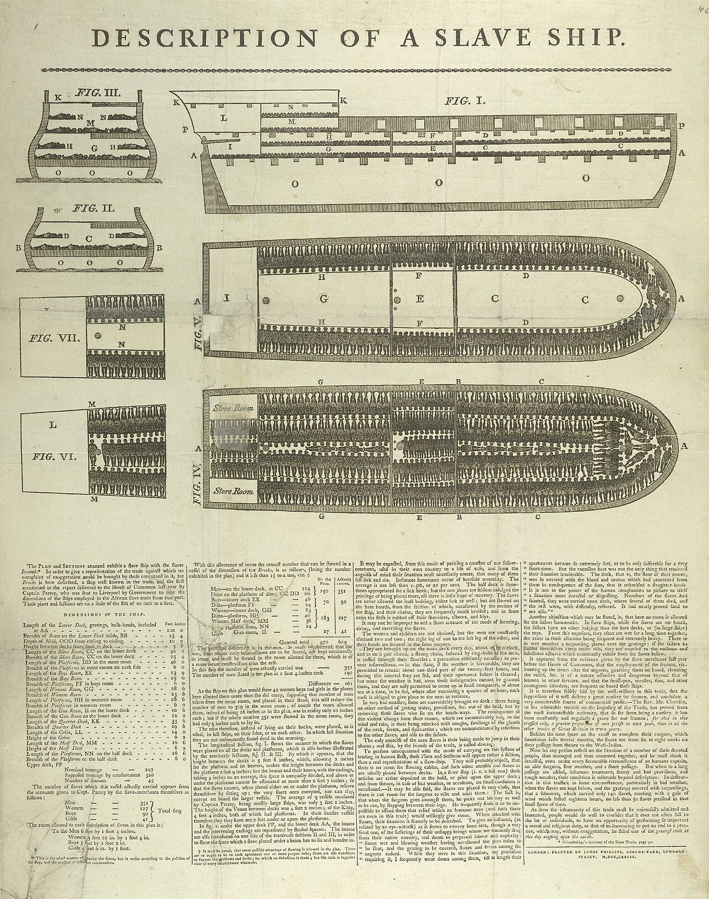

You have been taught exactly one story about discrimination. It has one villain, one victim, and one civilization in the dock. That is not education. That is a curriculum designed by people with a past to hide.

Discrimination is not unique to one civilization. It has existed in every part of the world, in different forms, under different names. The only difference is that some civilizations are forced to confess, and others got to write the textbooks.

## The convert-or-die religions

Let us start with the religions that lecture the world about tolerance. The Abrahamic faiths, at various points in their history, have been brutally rigid: they literally asked people to convert or die. They discriminate on the basis of religion, openly, theologically, and for centuries, violently.

History records it again and again. The Almohads in medieval Spain gave Jews and Christians the choice of conversion or death. The Spanish Inquisition did the same centuries later. In 2014, ISIS gave the Yazidis of Iraq the same old choice: convert, or die, and thousands who refused were killed or enslaved. This is not ancient history. It happened in our lifetime, on camera.

And yet the followers of these traditions stand on podiums and lecture Hindus about discrimination. A civilization whose scriptures never ordered the killing of unbelievers is taught morality by traditions that practiced it.

## The slave ships

Do you even know what was the condition of human slaves under the Abrahamic religions, or under white rule? Because you were never taught it, not properly.

More than 12 million Africans were chained, packed into ships like cargo, and transported across the Atlantic. Millions died on the voyage. Those who survived were worked to death on plantations. And this was not done by outlaws. It was done by Christian empires, blessed by priests, justified with theology. Preachers cited the so-called "Curse of Ham" to argue that Black people were divinely ordained to servitude. The Bible was used as a bill of sale.

The western countries which teach us about caste-based discrimination quietly skipped this chapter. You are only taught about caste-based discrimination because western society wants to whitewash its past. If your own history includes slave ships, witch burnings and genocides, the smartest move is to make sure the classroom is always discussing someone else's sins.

## The colour line at home

The same West that teaches India about caste ran a caste system of its own, written in law, enforced with violence, based on skin colour. "Whites Only" signs on water fountains, schools, buses and lunch counters. Segregation upheld by courts. Lynchings as public entertainment. This continued into the 1960s, within living memory.

And it did not end with the laws. Blacks still face discrimination in the USA today, in policing, in hiring, in housing, in everyday life. Asians and Africans face discrimination across the West. Indians face discrimination in South Korea and Australia; the attacks on Indian students in Australia made global headlines. Discrimination did not disappear. It just learned better language.

## Discrimination wears many masks

Look at the Islamic world. Minorities face open, legal discrimination in Islamic countries. Take Pakistan: its constitution, in Article 41(2), says no person is qualified for election as President unless he is a Muslim. Article 91(3) says the National Assembly shall elect one of its Muslim members as Prime Minister. A bill to allow non-Muslims to hold these offices was tabled in the National Assembly, and it was rejected. In Pakistan, the PM or President cannot be from a minority religion. That is discrimination written into the constitution itself.

So let us count the forms. Caste. Skin colour. Race. Ethnicity. Religion. And the oldest one of all: social status, the poor and the rich. Caste-based discrimination was a social evil, and it existed in every part of the world. Only the label changed. Where India said caste, the West said colour. Where India said jati, others said race, or creed, or class.

## Varna is not caste

And now the part that is deliberately misunderstood. What is attacked as the "caste system" is actually the varna system, and varna is decided by karma, not birth.

The Bhagavad Gita says it directly: "chaturvarnyam maya srishtam guna-karma-vibhagashah", the four varnas were created according to guna (qualities) and karma (deeds), not according to the family you are born into. A Brahmin can become a shudra by his actions, and a shudra can become a Brahmin by his. The tradition is full of examples: Valmiki, born a hunter, became a Brahmarshi; Parashuram, born a Brahmin, lived as a Kshatriya warrior; Tulsidas and Krishna, the Yadav, revered across the land regardless of birth labels.

Birth-based caste rigidity was a later social corruption, not the religious doctrine. The doctrine itself says you are what you do.

## Why only Hindus are targeted

So why is only Hinduism in the dock? Because it suits the people who built the dock.

The West needs India to be the land of caste oppression, because that story covers the slave ships, the witch trials, the segregation and the genocides. The Abrahamic missionaries need Hinduism to look cruel, because that justifies the conversion machine. And I can proudly say Hinduism never persecuted or discriminated against any religion. No crusades. No inquisitions. No convert-or-die. Jews, Parsis, Syrian Christians and Muslims lived and thrived in India for centuries, protected by Hindu kings, when the rest of the world was hunting them.

Caste discrimination was real, and it was a social evil, and Indians themselves fought it, from Buddha to Gandhi to Ambedkar to Raja Ram Mohan Roy. We do not need lectures from civilizations that packed humans into ships and burned women as witches.

## One scale for everyone

Here is my challenge. Judge every civilization by the same scale. Count the slave ships with the caste abuses. Count the witch trials with the sati cases. Count the "Whites Only" signs with the varna distortions. Count the constitutions that bar minorities from high office.

When you do, you will find that discrimination is a human disease, not a Hindu one. And you will find that the civilization being lectured is the one that never sent a single inquisitor, never packed a single slave ship, and never asked anyone to convert or die.

Remember that the next time someone says only one word: caste.
