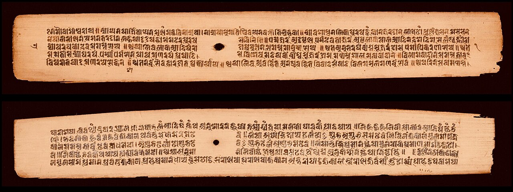
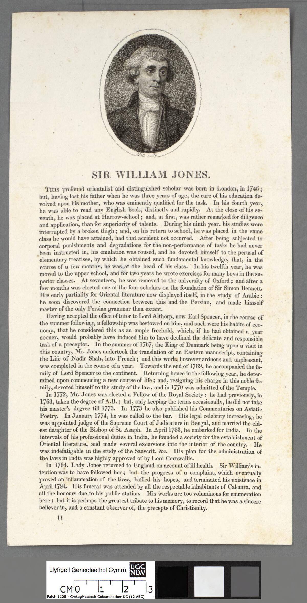

Let's begin with a question: how many ordinary Hindus actually read Manusmriti?

Most don't.

How many Hindus perform their daily puja by opening Manusmriti?

How many Hindu families use it as their religious handbook?

How many temples tell devotees that Manusmriti is the compulsory rulebook of Hinduism?

Yet Manusmriti is constantly dragged into conversations about Hinduism as though it were the Hindu equivalent of a universally binding religious constitution.

That premise itself deserves to be questioned.

## Manusmriti is not Hinduism

Manusmriti is an ancient Dharmashastra text. It is a historical work dealing with ideas of law, duties, conduct and social order.

It is not the entirety of Hindu scripture.

Hindu civilization has produced an enormous body of literature: the Vedas, Upanishads, Bhagavad Gita, Ramayana, Mahabharata, Puranas, Agamas, Sutras, Smritis and countless philosophical and regional traditions.

So why take one text and declare:

"This is what 1.2 billion Hindus believe"?

That isn't a serious way to understand a civilization.

If someone takes one controversial text from another civilization, quotes its harshest passages and declares that the text represents every believer today, we would immediately call that an oversimplification.

The same standard should apply to Hinduism.

## The biggest mistake: treating Manusmriti as a universal Hindu constitution

There is no historical basis for imagining that every Hindu kingdom, village and family throughout Indian history operated according to a single centrally enforced copy of Manusmriti.

India never had one centralized Hindu religious authority controlling every community.

Different regions developed different customs.

Different communities developed different social institutions.

Different philosophical schools developed different interpretations.

Different kingdoms followed different legal and administrative traditions.

Manusmriti was therefore one part of a much larger intellectual and legal tradition, not a universally enforced constitution of every Hindu society.

## Varna is not simply "caste"

Another common debate tactic is to take the modern word caste and project it backwards onto every reference to varna.

That is historically much more complicated.

The fourfold varna framework is described in Hindu literature through concepts such as guna and karma.

The Bhagavad Gita explicitly connects the fourfold classification with qualities and actions.

That is fundamentally different from the simplistic claim:

"Hinduism teaches that your social position is permanently determined by the family you were born into."

The philosophical concept of varna and the enormous variety of hereditary jatis that developed historically should not simply be treated as identical things.

## "But Manusmriti contains caste rules."

And?

A historical text containing a particular prescription does not automatically prove that the prescription represents the essential teachings of an entire religion.

This is the critical distinction.

A text can contain an idea without that idea defining an entire civilization.

Manusmriti can be studied.

Its ideas can be debated.

Its historical influence can be examined.

Its controversial passages can be criticized.

But turning it into the constitution of every Hindu is another matter entirely.

## The "Manusmriti = Hinduism" argument collapses under its own weight

Ask the person making the argument:

Do you consider every verse of every Hindu Smriti universally binding?

If not, why Manusmriti?

Ask:

Do all Hindu traditions recognize Manusmriti as their supreme authority?

They don't.

Ask:

Does the average Hindu even use Manusmriti in everyday religious practice?

Generally, no.

Then ask the most important question:

"Why should an ancient Dharmashastra text be treated as a complete description of Hinduism when Hindu religious traditions themselves are vastly broader than that text?"

That is where the argument becomes much harder to sustain.

## Hindu civilization cannot be reduced to one ancient text

Hinduism is not a religion built around one book and one prophet.

It developed through thousands of years of philosophical debate, regional traditions, schools of thought, devotional movements and different interpretations of dharma.

There are Hindu traditions that emphasize:

- devotion;
- knowledge;
- meditation;
- duty;
- renunciation;
- yoga;
- philosophical inquiry;
- temple worship;
- personal deity traditions;
- and numerous other paths.

Trying to reduce all of this to Manusmriti is like looking at one chapter of a civilization's intellectual history and pretending you have explained the entire civilization.

You haven't.

## The historical record is also more complicated than the stereotype

The simplistic narrative often says that Indian society was a completely rigid hierarchy in which people from supposedly "lower castes" were permanently excluded from education, political power and social advancement.

But Indian history contains numerous examples that complicate that picture.

Indigenous education records from the early nineteenth century, for example, document substantial participation by communities classified in British-era terminology as Shudra and other groups.

Indian history also contains powerful rulers and political formations associated with communities that today fall within Scheduled Tribe classifications, including Gond, Ahom and Bhil traditions.

That doesn't fit neatly into the idea of one completely uniform social system operating identically throughout the entire subcontinent for thousands of years.

Indian history was far more complicated.

## And what about Ambedkar?

Dr. B. R. Ambedkar's life itself demonstrates that Indian society cannot be reduced to a simple cartoon of permanent hostility between social groups.

Ambedkar experienced serious discrimination.

At the same time, he received support from people belonging to communities other than his own.

His teacher Mahadev Ambedkar is associated with the surname Ambedkar.

Sayajirao Gaekwad III supported his education.

His intellectual and political life involved interactions with people from many different social backgrounds.

The lesson is not that discrimination never existed.

The lesson is that Indian society was not one-dimensional.

There were conflicts.

There was cooperation.

There was hierarchy.

There was mobility.

There were reform movements.

There were competing ideas about dharma and social order.

History is complicated.

## Yet only Hindus are targeted

And here is the question nobody answers: yet only Hindus are targeted because of the caste system, which is actually the varna system category.

Varna is decided by karma, not birth. A Brahmin can become a shudra by his actions, and a shudra can become a Brahmin by his. The Gita says the fourfold order was created by guna and karma, not by the family you are born into. Valmiki the hunter became a Brahmarshi. Parashuram, born a Brahmin, lived as a Kshatriya warrior.

Every civilization in history had hierarchy and discrimination. The West had it by colour and race, the Islamic world has it by religion, the whole world has it by wealth. Only the Hindu version is turned into the definition of an entire religion, and only Hindus are put permanently in the dock for it.

That selectiveness is the tell. This was never about social justice. It is about which civilization gets to be judged by its worst verse, and which ones get to be judged by their best intentions.

## How "varna" became "caste": the colonial translation

There is one more piece to this story, and it explains where the modern word came from.

In 1794, Sir William Jones published his English translation of Manusmriti, the Ordinances of Menu. It carried the text to European readers for the first time, and it was produced inside the colonial project: the British administration wanted a single "Hindu law book" it could use to govern.

So a complex Sanskrit vocabulary was flattened into a single European word: "caste", borrowed from the Portuguese "casta". Two completely distinct concepts, varna (a theoretical fourfold framework based on qualities and deeds) and jati (the thousands of actual birth-communities with their own histories), were collapsed into one foreign label.

That flattening stuck. Generations of Indians were then taught, in English, to see their own society through a Portuguese word filtered through a colonial translation. The debate we have today about "caste" still runs on that imported vocabulary.

If the word itself arrived through colonial translation, why should the colonial framing of Hindu society be treated as the final truth about it?

## The double standard needs to be challenged

If someone wants to criticize historical Hindu texts, they absolutely have the right to do so.

But apply the same methodology everywhere.

Don't take the most controversial text associated with one civilization and treat it as the definitive representation of everyone belonging to that civilization.

Don't take a historical prescription and automatically assume universal historical implementation.

Don't take one social institution and pretend it remained unchanged for thousands of years.

And most importantly:

Don't confuse criticism of one historical text with proof that an entire religion is fundamentally based upon discrimination.

## The real debate

The strongest Hindu position is not:

"Every historical practice associated with Hindu society was perfect."

That is unnecessary.

The stronger argument is:

"Show me why Manusmriti should be treated as the universal constitution of Hinduism."

Show me the evidence that every Hindu was required to follow it.

Show me the evidence that every Hindu tradition regarded it as supreme.

Show me why varna, jati and every historical caste practice should be treated as one identical institution.

Show me why a complex civilization should be defined by its most controversial ancient text.

Until those questions are answered, simply quoting Manusmriti and declaring "this is Hinduism" isn't an argument.

It is a shortcut.

Manusmriti is a historical Hindu text. It is not a synonym for Hinduism.

And Hindu civilization deserves to be studied as the enormously diverse intellectual and cultural tradition that it actually is, rather than being reduced to a handful of selectively quoted verses.
