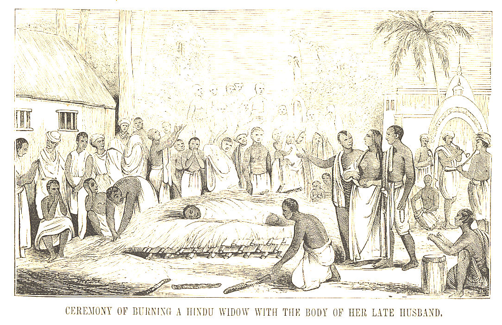
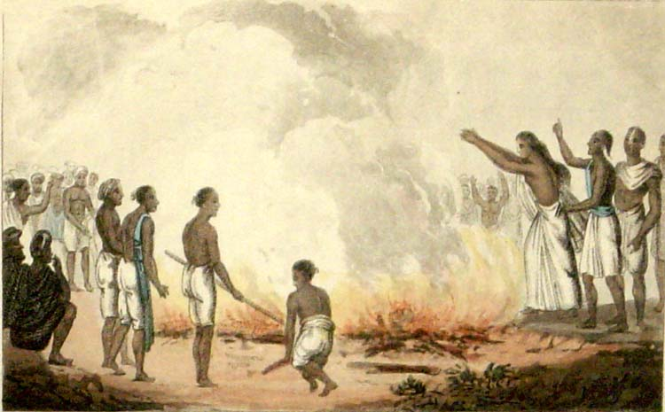
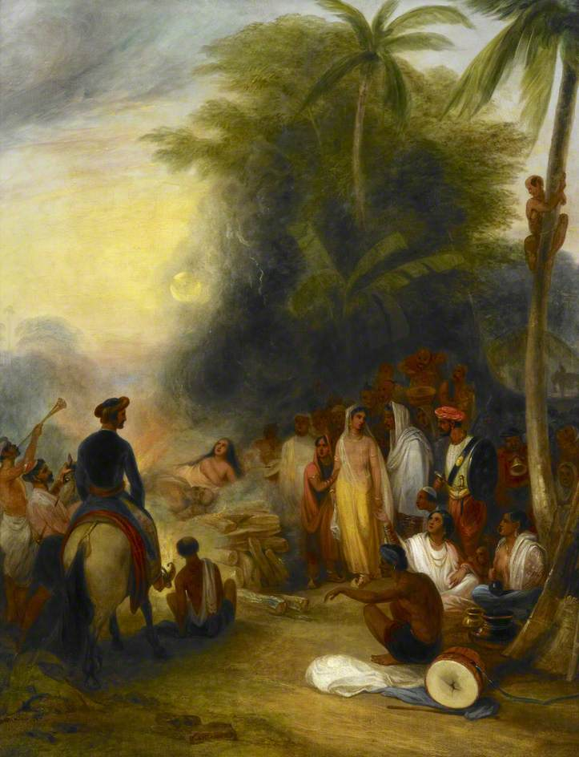

Sati Pratha is one of the most weaponized words in the debate about Hinduism. Say it, and the conversation stops. It is treated as proof that Hindu civilization was uniquely cruel to women, a charge sheet with one entry that supposedly settles everything.

But almost everything people assume about Sati is wrong. It was never in the Vedas. It was never universal. It was never religiously mandated. And the story of how it grew has far more to do with foreign invaders than with Hindu scripture. Let me lay out the facts.

## Never in the Vedas or Upanishads

This is the foundation, so let me be precise. Sati Pratha, while undeniably a part of history, was never promoted in the Vedas or Upanishads. In fact, there is no mention of burning widows in core Vedic scriptures.

Professor David Brick of the University of Michigan, in his paper on the Dharmasastric debate over widow burning, states plainly: there is no mention of sahagamana (sati) whatsoever in Vedic literature, not in the Samhitas, not in the Brahmanas, not in the Aranyakas, not in the Upanishads, and not in any of the early Dharmasutras or Dharmasastras. The historian Altekar found the Brahmana literature, dated roughly 1000 BCE to 500 BCE, entirely silent about sati.

What the Vedas actually say points the other way. Rig Veda 10.18.7 describes a widow lying beside her dead husband, and she is asked to rise, to leave the grieving, and to return to the world of the living. A prayer is then offered for her happy life, with children and wealth. Later interpreters who wanted scriptural cover for widow burning twisted a single word in this verse to manufacture a sanction that was never there. The Atharvaveda says it directly: "Rise, woman. Come to the world of the living." The Taittiriya Aranyaka describes the widow taking her husband's bow, gold and jewels from the pyre side, with the expressed hope that she and her relatives would lead a happy and prosperous life afterwards.

A scripture that tells the widow to rise and live is not a scripture that commands her to burn.

## Voluntary, never mandated

Later texts like some Puranas mentioned it, and even then, it was not a widespread or religiously mandated practice. It evolved in certain communities and was often socially enforced, not scripturally.

And here is a detail the critics skip: where the Hindu scriptures do discuss sati, they portray it as a wholly voluntary act. Professor Brick again: sati is not portrayed as an obligatory practice, nor does the application of physical coercion serve as a motivating factor in its lawful execution. The 9th-century commentator Medhatithi strongly opposed sati, calling it suicide, a sin, not a sacrifice.

So the scriptural record, taken honestly, is this: the oldest texts are silent or opposed, the later texts describe it as voluntary, and the great commentators condemned it. That is not a religious mandate. That is a social custom that grew in the shadows of scripture, not in its light.

## A late arrival, not an ancient Vedic rite

Unlike scriptures, archaeology does not lie. The earliest solid physical evidence of sati in India appears not in the Vedic age but more than a thousand years later: the Eran inscription of 510 CE in Madhya Pradesh, which records the wife of a commander named Goparaja entering his funeral pyre. The memorial sati stones, carved with hand symbols, are found mainly in north and western India, in Rajasthan and Gujarat, and they date to the medieval period.

Sati was not a Vedic tradition. It was a post-Gupta era social development. Anyone who tells you it stretches back to the dawn of Hinduism is inventing history.

## Regional, not universal

Sati, or widow immolation, was a ritual associated with certain Hindu communities in which a widow died on, or in connection with, her deceased husband's funeral pyre. It was never a universal practice among Indian women. Historical evidence indicates that it was concentrated particularly among certain upper-caste and ruling groups and was especially associated with regions such as Rajasthan, the Gangetic region, Punjab and parts of southern India.

That regional and social limitation matters. Describing sati as though it represented the ordinary treatment of widows throughout India gives a misleading picture of its historical prevalence. The vast majority of Indian widows in history did not commit sati. Most lived on, worked, raised families. The practice belonged to specific communities in specific regions, often warrior and ruling families where honour codes around death ran deep.

## The question of consent

There is also an important question of agency. Historical accounts describe women who appeared to approach the ritual voluntarily and regarded it as an act of devotion, honour or religious duty. In the scriptural framing, it was the act of a pativrata, a devoted wife, choosing to follow her husband. Whether we today find that choice comprehensible or not, erasing the agency of these women and painting every one of them as a passive victim is its own kind of condescension. They had beliefs, and they acted on them.

## The invaders

Now the part nobody wants to discuss. The practice grew and hardened in the age of foreign invasions, and that timing is not a coincidence.

When invading armies swept through India, what happened to the women of defeated kings and soldiers? They were captured. They were taken as war prizes, distributed as concubines, made sex slaves. This is not speculation. It is the documented pattern of medieval warfare everywhere, and India was no exception.

Against that background, look at jauhar, the Rajput practice of mass self-immolation. When defeat was certain and the invaders were at the gates, Rajput women chose fire over capture. That choice, between death by fire and a life of violation and slavery at the hands of invaders, tells you everything about the world these women lived in.

Sati evolved more because of foreign invaders, who captured widows and made them sex slaves. A widow in a conquered land, without her husband's protection, faced a real and known fate. In that brutal context, the funeral pyre could appear as the honourable alternative, the one death a woman could choose for herself rather than the life the invaders would choose for her. You do not have to approve of the choice to understand the conditions that produced it. Blame the invasions that made widows into prey, not only the custom that grew in their shadow.

## Abolished, and the double standard

The British abolished sati in 1829 through the Bengal Sati Regulation, pushed by Indian reformers like Raja Ram Mohan Roy. It ended nearly two centuries ago.

Now set that beside Europe. While critics use sati, a regional, non-scriptural, voluntarily-framed practice abolished in 1829, to indict an entire civilization, Europe spent three hundred years, from 1450 to 1750, hunting, torturing and executing 40,000 to 60,000 people as witches, three-quarters of them women, many burned alive, with the full machinery of church courts, secular courts, universities and the printing press behind it. (Read the full account in my companion piece, "Witch Hunting: Worse Than Sati".)

One of these is treated as a unique stain on a religion. The other is a footnote. Historical atrocities should be studied honestly rather than selectively used to attack one particular civilization or religion. Sati deserves honest study: what it was, where it happened, why it grew, and how it ended. What it does not deserve is to be ripped out of context and used as a weapon by people who have never honestly confronted the fires their own civilization lit.
