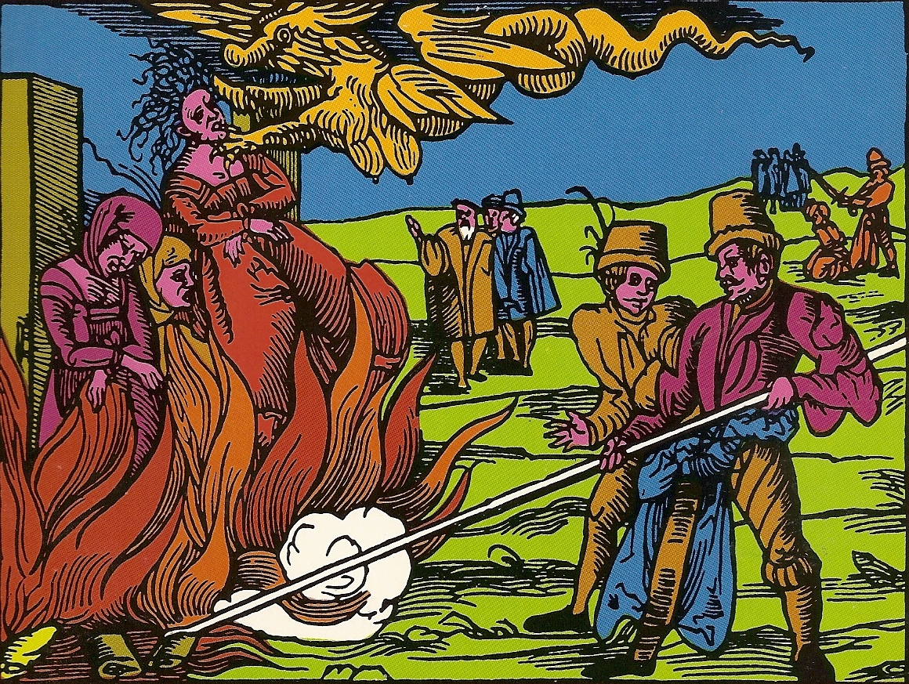
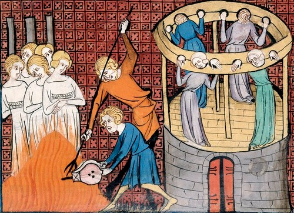

Imagine you are a woman in Germany in the year 1629. You are poor. Your husband is dead. Your neighbours whisper that the failed harvest is your fault, that the sick child down the lane fell ill because you looked at him. One morning, men come to your door. They do not ask questions. They already know you are a witch, because someone under torture named you. You will be tortured until you confess, and then you will be burned alive in front of the whole town. Your children will watch.

This is not fiction. This happened to tens of thousands of women in Europe, over three hundred years, with the full machinery of law, church and state behind it. And the same civilization that did this lectures India about Sati.

## The numbers no one wants to say out loud

Modern historians, working from court records across Europe, place the scholarly consensus at 40,000 to 60,000 people executed for witchcraft between roughly 1450 and 1750. The peak of the killing came between 1580 and 1630, during the wars of religion. This is not a fringe estimate. It is the mainstream academic position.

Seventy-five to eighty percent of the victims were women. In the words of one historian, the witch craze could only become a mass hysteria once it was directed primarily at women. The typical victim was the wife or widow of a poor farmer or labourer. She was often old. She was often unpopular, quarrelsome, or simply alone. More than 70 percent of accused women in some regions were widows.

Let me be clear about one thing. You will sometimes read that nine million women were killed. That number is a myth, invented in a 1791 pamphlet. I am not inflating anything. I do not need to. Forty to sixty thousand judicial murders of women is horrifying enough without exaggeration. The truth does not need padding.

## How the machine worked

In 1486, two Dominican inquisitors published the Malleus Maleficarum, the "Hammer of Witches". It was a manual: how to identify a witch, how to interrogate her, why the fire was necessary. It gave educated men a theological vocabulary for their fear and hatred of women.

The method was simple and self-feeding. Torture a woman until she confesses to witchcraft. Torture works, people confess to anything. Then demand the names of other witches. She names her neighbours to stop the pain. They are arrested, tortured, and they name more. One trial becomes a panic. Whole towns were consumed.

At the Wurzburg trials of 1629, at one point, children made up 60 percent of the accused. Children. They burned children as witches.

And do not imagine this was only the Catholic Church. Catholic and Protestant territories both ran witch trials. Many prosecutions happened in secular courts, not church courts. After the Reformation, fear of witches was one of the few things divided Christians could agree on.

## Burned, hanged, beheaded

The punishments varied by region, which tells you how bureaucratic the cruelty was. In much of continental Europe, burning was favoured, because it was considered more painful. In England, they generally preferred hanging. Some victims were beheaded, some strangled before the fire as a mercy. Mercy.

People died in unsanitary prisons before they ever reached the stake, and those deaths are not even counted in the 40,000 to 60,000. The unofficial lynchings went unrecorded. The real toll of the panic is higher than the consensus number.

## Now talk to me about Sati

Here is why this matters, and why I am writing this.

People frequently cite Sati when criticizing Hinduism, while ignoring the historical context and the fact that it was never a universal practice across India. Sati was never promoted in the Vedas or Upanishads. There is no mention of burning widows in core Vedic scriptures. Later texts like some Puranas mentioned it, and even then, it was not a widespread or religiously mandated practice. It evolved in certain communities, in certain regions, and it was abolished in 1829.

Now compare. Europe, over three centuries, with the printing press, universities, courts, bishops and judges, systematically hunted, tortured and executed tens of thousands of women, most of them poor, many of them old, some of them children, for the crime of witchcraft. A crime that did not exist.

If Sati is held up as proof that Hindu civilization is uniquely cruel to women, then what does the witch hunt prove about European civilization? By every honest measure, the witch hunts were worse than Sati. More victims. More systematic. Longer lasting. Carried out by the most educated institutions of the age, not by village custom.

## Feel the guilt

I am not writing this to excuse Sati. Sati was real, and it was wrong. I am writing this because historical atrocities should be studied honestly rather than selectively used to attack one particular civilization or religion.

If you feel horror reading about women burned as witches, good. You should. Sit with it. Let it disturb you. That guilt you feel is the correct response to history.

Now ask yourself why you were never taught to feel it. Ask yourself why one civilization's crimes are a footnote and another civilization's crimes are a weapon. The fire that burned those women in Wurzburg and Trier and Bamberg was lit by the same Europe that now lectures the world on human rights. Remember that the next time someone brings up Sati to shame India, while the ashes of sixty thousand witches lie quietly under European soil.

Study history honestly, or do not study it at all.
