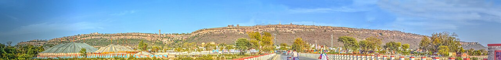

Open a school history textbook and count the pages. The Delhi Sultanate and the Mughals get chapters. The kings who fought them, and often beat them, get paragraphs. Some get a single line. A few do not appear at all.

This is not about replacing one one-sided history with another. It is about restoring balance, and doing it with facts that can be checked. Every claim below has been verified against standard sources. Where a popular number has no scholarly backing, that is stated plainly. Where the draft of this article contained an error, it has been corrected rather than repeated.

## Prithviraj Chauhan: the victory before the defeat

Every schoolchild learns that Prithviraj Chauhan lost the Second Battle of Tarain in 1192 to Muhammad Ghori. Far fewer learn that he won the First Battle of Tarain a year earlier, in 1191, near Taraori in present-day Haryana. Ghori was wounded in that battle and retreated to Ghazni. He returned the next year better prepared, and that second battle ended Chauhan's rule. The defeat is taught. The victory that preceded it is treated as a footnote.

## Rana Sanga: 18 battles against three sultanates

Rana Sanga of Mewar is traditionally said to have won 18 battles against the sultans of Delhi, Malwa and Gujarat. His record against the Delhi Sultanate alone is remarkable. At Khatoli in 1517 (some sources say 1518), he defeated Ibrahim Lodi and was so severely wounded that he lost an arm. At Dholpur in 1518 or 1519, he beat Lodi again. At Gagron in 1519, he defeated Mahmud Khilji II, the Sultan of Malwa, captured him, and then released him.

In 1527 he took on Babur. At Bayana early that year, Rajput forces drove Babur's detachments from Bayana fort, a genuine victory, though it is often overstated as Sanga defeating Babur in person. The decisive clash came at Khanwa near Agra in March 1527, where Babur's artillery and battlefield tactics broke Sanga's confederacy. Sanga died soon after. The man who humiliated two sultans in battle after battle is remembered, if at all, for the one battle he lost.

## Hemu: the king for a month

Hemchandra Vikramaditya, known as Hemu, is documented to have won 22 engagements between 1553 and 1556 as the chief minister and army commander of Islam Shah Suri, fighting Afghan rebels and then the Mughals. On 7 October 1556 he captured Delhi itself from Akbar's forces at Tughlaqabad and had himself crowned Vikramaditya at Purana Qila. For about a month, a Hindu king sat on the throne of Delhi between the Sur and Mughal empires.

It ended at the Second Battle of Panipat on 5 November 1556. Hemu was struck by an arrow in the eye, captured unconscious, and beheaded on Bairam Khan's orders. That beheading secured Akbar's throne. The empire Akbar built rests, in part, on the elimination of a rival most textbooks never name.

## Shivaji: what the record actually shows

Shivaji's military record needs no inflation, which is why inflated numbers should be left out. No academic history documents a figure of "70 battles won" for him, so this article will not repeat it. What the record does show is enough.

On 10 November 1659 at Pratapgad, he killed the Bijapur general Afzal Khan at a supposed truce meeting and destroyed his army. On 4 February 1670, his commander Tanaji Malusare recaptured Sinhagad (Kondhana) from the Mughal commander Udaybhan Rathore at the cost of his own life; Shivaji renamed the fort in his honor. On 17 October 1670, returning from the second sack of Surat, his forces defeated the Mughal commander Daud Khan Qureshi in open battle at Vani-Dindori near Nashik.

Two corrections to commonly circulated lists: the Battle of Kolhapur against Bijapur's Rustam Zaman was fought on 28 December 1659, not 1655. And there was no Battle of Wadgaon in 1670. The only Battle of Wadgaon in history was fought in January 1779, during the First Anglo-Maratha War, 99 years after Shivaji's death. Lists that include it are copying from each other, not from history.

## Bajirao I: the undefeated Peshwa, credited correctly

Bajirao I, Peshwa from 1720 to 1740, never lost a battle he commanded. At Palkhed on 28 February 1728, his light cavalry encircled Nizam-ul-Mulk Asaf Jah I and forced the Treaty of Mungi Shevgaon, compelling the Nizam to recognize Shahu as Chhatrapati and Maratha revenue rights in the Deccan. It remains a textbook example of manoeuvre warfare. At Bhopal on 24 December 1737, he defeated a combined Mughal force sent by Emperor Muhammad Shah, and the resulting treaty gave Malwa to the Marathas with a 50 lakh rupee indemnity.

But credit must go where it is due. The 1739 capture of Vasai from the Portuguese, ending their dominance north of Goa, was commanded by Bajirao's younger brother Chimaji Appa, with Malhar Rao Holkar and others. Bajirao was alive at the time but did not lead that campaign. Similarly, the Maratha victory at Kharda in 1795 over the Nizam belongs to a later generation entirely, 55 years after Bajirao's death. Giving Bajirao every Maratha victory does him no honor; his real record is strong enough.

## Sambhaji Maharaj: nine years against an empire

Sambhaji, crowned in July 1680, held off Aurangzeb's entire Deccan invasion for nearly nine years. Popular accounts credit him with 120 battles, but no academic history has verified a battle-by-battle count, so treat that number as tradition, not record. What is documented is the achievement itself: the full military weight of the Mughal Empire could not subdue the Marathas for almost a decade, and one documented failure, the unsuccessful siege of Janjira in 1681-82, shows he was a commander, not a legend.

He was not defeated in pitched battle. On 1 February 1689, Mughal commander Muqarrab Khan, guided by the traitor Ganoji Shirke, surprised his small detachment at Sangameshwar. After five to six weeks of torture, during which his eyes were gouged and his tongue cut for refusing Aurangzeb's terms, he was executed on 11 March 1689 at Tulapur on the Bhima river. Aurangzeb expected the Maratha resistance to die with him. It did not.

## The Ahoms: the kingdom the Mughals could not take

From 1615 to 1682, the Ahom kingdom of Assam fought off repeated Mughal invasions. The most famous was the naval battle of Saraighat in 1671, where the Ahom commander Lachit Borphukan defeated the Mughal army under Raja Ram Singh I on the Brahmaputra near Guwahati. The final expulsion came at Itakhuli in 1682, after which the Mughals never returned.

Assam's government popularly cites 17 Mughal defeats, and that figure is repeated widely, though academic histories do not fix on that number. Honesty also requires noting that the Mughals did not lose every round: Mir Jumla's invasion of 1662-63 occupied the Ahom capital Garhgaon and imposed a humiliating treaty, and the Mughals reoccupied Guwahati from 1679 to 1682. The accurate statement is that the Ahoms were never absorbed by the Mughals. They were eventually subjugated by others: the Burmese invasions of 1817-1826 devastated the kingdom, and the British annexed it after the Treaty of Yandabo in 1826.

## The Mughal record, stated plainly

A balanced history does not hide the other side either. Aurangzeb had his brother and designated heir Dara Shikoh executed on 30 August 1659 after a trial for apostasy. He deposed his father Shah Jahan and confined him in Agra Fort from July 1658 until his death in January 1666, nearly eight years. His eldest child, the Persian poet Zeb-un-Nissa, spent roughly the last 20 years of her life confined in Salimgarh Fort, accused of corresponding with her rebel brother.

Some popular claims, however, do not survive checking. Akbar did not have 300 wives. Historians put the number of his legal wives at roughly 30 to 36, mostly political alliances. The "300" figure confuses wives with the wider harem household, which Abu'l Fazl's Ain-i-Akbari numbered at about 5,000 women including attendants, guards and dependents. Shah Jahan did not have 10 wives either; contemporary chroniclers and modern scholarship document three to four. What is verified is that Mumtaz Mahal died on 17 June 1631 at Burhanpur giving birth to her 14th child.

One more correction matters because this site exists to bust misinformation, not spread it. A salacious claim circulates online that Shah Jahan had an incestuous relationship with his daughter Jahanara. Its origin is a 17th-century French traveler's account: Francois Bernier wrote that "rumour has it" such a thing occurred, citing bazaar gossip from men with no access to the imperial household. Niccolao Manucci, one of the few Europeans with genuine court access, explicitly repudiated Bernier's version. No serious historian accepts the claim. Repeating it as fact would be exactly the kind of propaganda this article opposes.

## Who wrote the textbooks: the education ministers, 1947-1977

A persistent claim holds that India's early education ministers shaped a history curriculum soft on invaders. The names usually listed are real, but the list is routinely given incomplete and misspelled, so here is the full record for 1947 to 1977: Maulana Abul Kalam Azad (1947-1958), K.L. Shrimali (1958-1963), Humayun Kabir (1963), M.C. Chagla (1963-1966), Fakhruddin Ali Ahmed (1966-1967), Triguna Sen (1967-1969), V.K.R.V. Rao (1969-1971), Siddhartha Shankar Ray (1971-1972), and S. Nurul Hasan (1972-1977). Nine ministers, not five.

One description in circulation is flatly false and should be retired: the claim that Maulana Azad was "uneducated." Azad received a rigorous traditional Islamic education in Arabic, Persian, philosophy, theology and logic, taught himself English, history and politics, and knew six languages. He founded the Urdu weekly Al-Hilal at 24, wrote the celebrated Quranic commentary Tarjuman-ul-Quran, served twice as Congress president, created the Sahitya Akademi, Sangeet Natak Akademi and Lalit Kala Akademi, established the University Grants Commission, helped found the IITs, and was awarded the Bharat Ratna in 1992. He held no Western university degree. "Uneducated" he was not.

Readers can draw their own conclusions about textbook bias from the complete list. Conclusions drawn from half a list are not worth much.

## Did the Mughals really rule "all of India"?

At its peak under Aurangzeb, who died in 1707, the Mughal Empire covered roughly 3.2 million square kilometers and ruled an estimated 150 million people, about a quarter of the world's population. It was the largest polity in Indian history to that point, and saying so is not glorification, it is fact.

But "the whole of India" it was not. The Ahom kingdom in the northeast was never absorbed, as shown above. The Malabar coast, including Travancore and Cochin in Kerala, remained outside Mughal control. Portuguese Goa, taken in 1510, was never Mughal territory. And Maratha resistance in the interior was never fully crushed even by 1707. "Most of the subcontinent" is accurate. "All of India" is not.

## Why this matters

None of this diminishes what the Mughals built or the complexity of medieval India. It restores proportion. Prithviraj's victory at Tarain, Sanga's eighteen battles, Hemu's march on Delhi, Shivaji's forts, Bajirao's cavalry, Sambhaji's nine-year resistance, and the Ahom navy's stand at Saraighat are not footnotes to someone else's story. They are the story, and they deserve their chapters.
